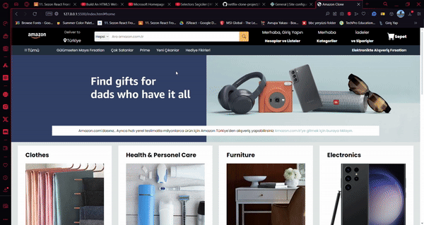

# Kişisel Tanıtım Sitesi

Bu proje, HTML ve CSS kullanarak Amazon temel alınarak oluşturulmuş basit bir klon arayüzdür.

## Kurulum

1. Bu projeyi klonlayın:

   ```bash
   git clone https://github.com/cengo14/amazon-clone-project.git
   ```

2. Proje klasörüne gidin:

   ```bash
   amazon-clone-project
   ```

3. `index.html` dosyasını tarayıcınızda açın.

## Ekran Görüntüsü




😊
